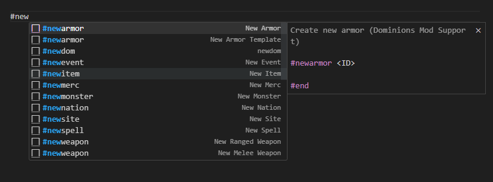
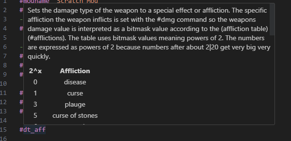
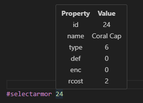

# dominions-mod-support README

This extension provides syntax highlighting, autocomplete and hover information on commands. 

## Features

Full list of known commands and information about it. As well as auto formated snippets when creating/editing objects like monsters or items.

Addtional details including relevent tables for some keywords. Will add more in the future.

Error checking for illegal values and missing #end commands.

If you refernce a vanilla asset such as with #selectarmor, if you hover over the value it will give you details of what armor you are selecting. 

Commenting and uncommenting hotkey support. 
 

## Known Issues

I'm sure there's a handful. Just undocumented so far. See below.
There's missing diagnostics and some are intentionally disabled due to needing some refactoring to account for edge cases. 
+ Copy Sprite hover will always show monster details regardless if its in an item's section. 

A lot of commands have no maximum value listed so i've guessed or used seemingly reasonable values. If you find errors, please let me know. 

## Release Notes

There is likely errors in my data for all the commands. I did a lot of scraping and regex instead of going through it by hand. If you catch any and are feeling extra generous please fix and submit a pull request. Or if not and it's small just let me know via discord @zegma and I can include the fix in during an update. 

### 2.0.7

Caught up to dom version 6.24
Added before but forgot to make a note, support for hotkey commenting. Ctrl-K to comment a selected text, Shift-Ctrl-K to uncomment.

### Credits
I wanted to highlight [djmcgill](https://github.com/djmcgill/vscode-syntax-highlighting-dominions-5-) for creating a syntax highlighting tool years ago. Used that for a while and the decided I wanted to improve on that base. 

Thanks [logg-y](https://github.com/Logg-y) for the list of mod manual missing commands. 

Thanks [larzm42](https://github.com/larzm42/dom5inspector) for raw game data.

General thanks to all the folks in the [Dom Modding Discord](https://discord.gg/4nX6bHPP). Plenty of help when getting clarification of mechanics to provide more accurate information in this extension. 

### ToDO

In no particular order things I want to do. 

+ Change the hover for ID on monster and item sprite commands to return sprite in addition to other data
+ Allow hover to return data on items/monsters by name instead of just by ID. Problematic due to all the damn warriors....
+ create warnings when selecting IDs out of vanilla asset range instead of error only when outside of all legal ranges

**Enjoy!**
